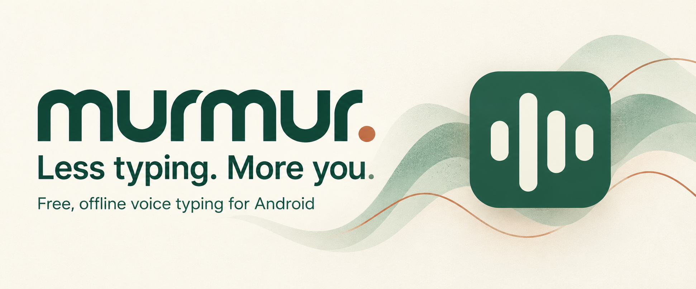

<div align="center">



# Murmur — free offline voice typing for Android

**Speak naturally. Keep your words on your phone.**

An open-source Android speech-to-text app with a floating dictation button, local AI, saved recordings, and optional writing assistance. Turn thoughts into messages, notes, and emails using your existing keyboard.

[](#device-requirements)
[](#local-models)
[](#privacy)
[](LICENSE)

[Get started](#get-started) · [Features](#features) · [Build an APK](docs/BUILDING.md) · [Privacy](docs/PRIVACY.md) · [Contribute](CONTRIBUTING.md)

</div>

## A little less typing. A little more you.

Murmur is a free, independent alternative to subscription voice typing tools such as Wispr Flow. Download the model inside the app, tap the floating logo in a supported text field, speak, and tap again to finish. Murmur transcribes locally, cleans up your words, and inserts the result. When insertion is unavailable, it copies your text to the clipboard.

**No Murmur account. No subscription. No local word quota.** Local dictation works offline after the models download. Optional cloud providers use your credentials and may charge for usage.

**Status:** Android preview, `0.7.0-test`, prepared for public review. [Build from source](docs/BUILDING.md) today. Prebuilt APKs will appear on [Releases](https://github.com/cryptobredda/murmur/releases) when the maintainer publishes them. Google Play and iOS releases are future work.

## Take a look

<table>
  <tr>
    <td align="center"><br /><strong>Speak naturally</strong></td>
    <td align="center"><br /><strong>Keep your words</strong></td>
    <td align="center"><br /><strong>Download in the app</strong></td>
  </tr>
</table>

<div align="center">
  
  &nbsp;&nbsp;
  
  &nbsp;&nbsp;
  
  <p><strong>Tap. Speak. Done.</strong> A small logo at rest, a waveform while listening, a spinner while working.</p>
</div>

App screens use the bundled UI with fictional data and a simulated Android bridge. Floating controls are shared-design UI previews; native cross-app placement varies by device. The cover is generated brand artwork. [More screens and capture instructions →](docs/IMAGERY.md)

## Features

### Dictation where you write

- **Automatic floating control** when Android exposes a focused editable field. Keep your normal keyboard; there is no Murmur keyboard to install.
- **Background recording and processing** without opening the main app from the native overlay.
- **Text insertion and clipboard fallback.** Password inputs are excluded; protected windows and some editors limit accessibility/overlays.
- **Compact and movable:** 48 dp idle control, 28 dp logo, 88 dp active control with waveform or spinner and cancel.
- **Remembered placement and adjustable transparency.** Drag to the bottom-centre dismiss area to pause for 10 minutes, or resume sooner in Settings.
- **Keep the phone awake only during recording/processing**, until output or cancellation. Field focus alone does not prevent sleep.
- **Quiet operation:** no routine formatting toast. Clipboard delivery can notify you; Android requires a foreground-service notification during active capture/processing.

### Recordings you can return to

- Audio is saved before transcription. Recognition failures retry the **same recording**, with up to three automatic attempts and manual reprocessing in History.
- Searchable, editable history with favourites, duration, raw recognition, and the writing method actually applied.
- Play saved recordings, export WAV audio, copy text, and export/import text backups.
- Interrupted or cancelled sessions remain available when usable audio was captured. Saved audio uses storage; uninstalling or clearing app data removes it.

### Your vocabulary. Your voice.

- Personal dictionary for names/terms, spoken snippets, and learning from transcript corrections.
- Smart cleanup for fillers, punctuation commands, self-corrections, and lists.
- Natural, polished, and verbatim styles; neutral, formal, and casual tones.
- Configurable writing profiles for email, messages, work chat, notes, and code.
- In-app voice commands to revise selected text or a whole draft, including shortening/translation with a configured writing provider.
- Optional **Qwen3 1.7B** local writing. A guard checks changes to protected details and can fall back to Smart cleanup. Review important text: recognition and rewriting can still make mistakes.

### Cloud and sync, when you want them

- Your own **OpenAI, Groq, or compatible custom endpoint**, with separate speech and writing providers.
- Remembered native-app credentials encrypted with Android Keystore.
- Optional encrypted history/vocabulary/settings sync to your own HTTPS/WebDAV storage, manually or automatically.
- Vocabulary-only sharing. Provider credentials and audio are excluded from sync and text backups.

## Get started

1. Install a maintainer-published [release APK](https://github.com/cryptobredda/murmur/releases), or [build one](docs/BUILDING.md).
2. Follow onboarding and **download Parakeet inside Murmur**. Downloads verify pinned SHA-256 checksums and support cancellation/resume.
3. Keep Smart cleanup for the lightest setup, or download optional Qwen3 writing inside the app. Cloud is optional.
4. Grant microphone access and enable Murmur's accessibility service for cross-app dictation/insertion.
5. Open a supported field, tap the logo, speak, and tap the waveform to finish. Cancel is available while listening or processing.

All model setup happens in the app. No manual model-file downloads or transfers.

## Local models

| Purpose | Model | Runtime | Download |
| --- | --- | --- | --- |
| Speech-to-text | NVIDIA Parakeet TDT 0.6B v3, INT8 | Sherpa-ONNX, CPU | Approximately 670 MB |
| Optional AI writing | Qwen3 1.7B, INT4 | LiteRT-LM, GPU with CPU fallback | Approximately 977 MB |
| Lightweight writing | Smart cleanup | Built-in rules | None |

Parakeet provides punctuation/capitalization and supports **25 European languages**: Bulgarian, Croatian, Czech, Danish, Dutch, English, Estonian, Finnish, French, German, Greek, Hungarian, Italian, Latvian, Lithuanian, Maltese, Polish, Portuguese, Romanian, Russian, Slovak, Slovenian, Spanish, Swedish, and Ukrainian.

The native catalogue intentionally offers one speech model and one optional writing model. [Sources, pinned revisions, and licences →](MODEL-NOTICES.md)

## Device requirements

| Setup | Practical recommendation |
| --- | --- |
| Speech + Smart cleanup | **8 GB RAM**, **1.5 GB free storage** before download |
| Speech + Qwen3 writing | **12 GB RAM**, **3 GB free storage** before downloads |
| Android / processor | **Android 13+**, recent flagship ARM64 processor, such as Snapdragon 8 Gen 2, 8 Gen 3, or 8 Elite |
| Installation minimum | Android 8 / API 26 and ARM64 |

These are practical recommendations, not vendor-certified phone minimums or guaranteed latency. Speed depends on recording length, RAM, processor, heat, and other apps. Android 13+ improves modern-editor insertion. Recordings need additional storage. Murmur shows guidance and device information during setup. [Sources and details →](docs/DEVICE-REQUIREMENTS.md)

## Privacy

Local mode processes speech/writing on your phone. Murmur has no account system, ads, or analytics SDK. Model downloads contact model hosts; optional cloud requests send relevant audio/text directly to your provider. Sync contacts your configured storage endpoint.

Microphone access captures dictation; accessibility identifies supported fields and inserts text. Audio/history remain in app storage until deleted, relying on Android device protection rather than separate Murmur encryption. Credentials are excluded from backups/sync; optional sync uses AES-256-GCM and a passphrase-derived key.

[Privacy and permissions →](docs/PRIVACY.md) · [Private security reporting →](SECURITY.md)

## Build and contribute

```sh
git clone https://github.com/cryptobredda/murmur.git
cd murmur
npm ci
npm test
npm run build
node scripts/android-assets.mjs
cd android
./gradlew testDebugUnitTest lintDebug assembleDebug
```

Requires Node.js 22+, JDK 21, and Android SDK 35. Output: `android/app/build/outputs/apk/debug/app-debug.apk`. Debug builds use your local signing key; updating an installed APK requires the same key. [Build guide →](docs/BUILDING.md)

Device reports, language feedback, docs, and focused contributions are welcome. Keep examples free of personal data. [Contributing →](CONTRIBUTING.md)

## FAQ

**Is it free?** The app code is MIT licensed and local dictation has no subscription or word quota. Optional cloud/storage providers can charge you.

**Does it work offline?** Local speech/writing do, after in-app downloads. Cloud providers and sync require connectivity.

**Will it appear in every app?** Accessibility and window security vary. Password fields, protected screens, and editors that do not expose input may prevent the overlay or insertion. You can dictate in Murmur and copy your text.

**Is there an iPhone app?** This implementation is Android only. No iOS/App Store build is available yet.

**Is Murmur affiliated with Wispr Flow?** No. It is an independent project with its own branding and implementation.

## Credits and licence

App source: [MIT](LICENSE). Separately downloaded model weights retain their own licences: Parakeet **CC BY 4.0**, Qwen3 **Apache-2.0**. [MODEL-NOTICES.md](MODEL-NOTICES.md) records creators and quantized conversions. Sherpa-ONNX and LiteRT-LM use Apache-2.0. React/Lucide retain upstream licences; bundled DM Sans/Manrope fonts include SIL Open Font License files in `public/fonts/`.

<div align="center">
  
  <p><strong>Your device. Your words.</strong></p>
</div>
