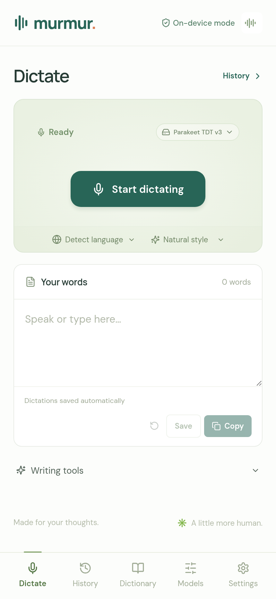
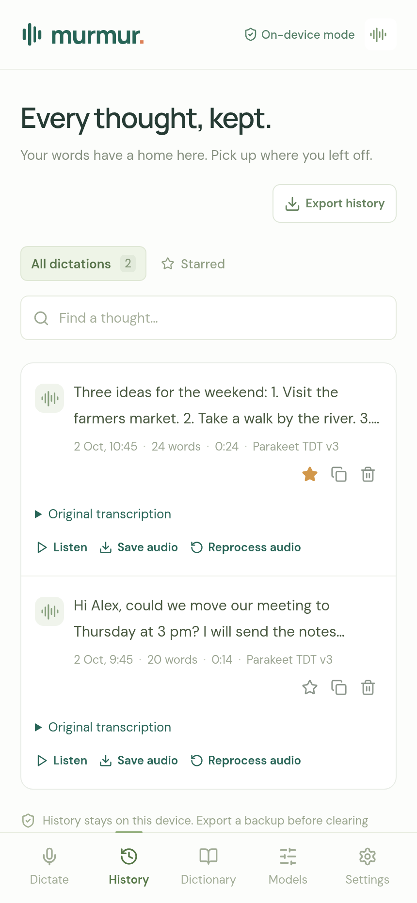
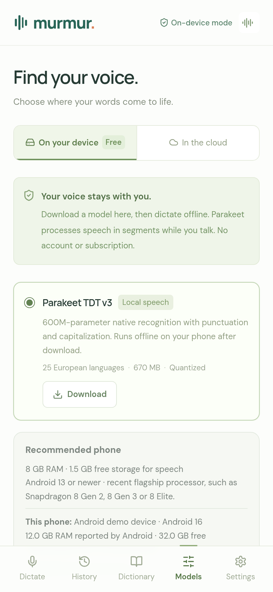
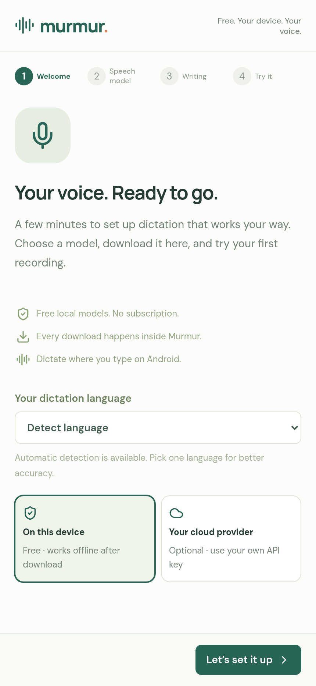
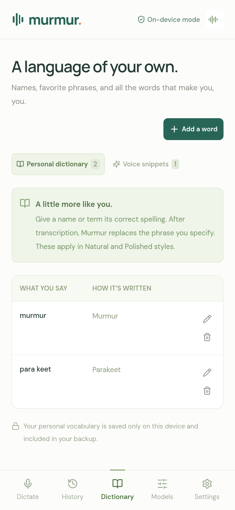
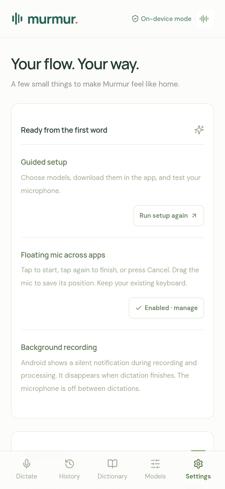

# Murmur imagery

The README combines generated brand artwork with captures of Murmur's actual interface. App captures use fictional text, a generic demo device, and a simulated Android bridge. They contain no user history, audio, credentials, or private account screenshots.

| Dictation | History | Models |
| --- | --- | --- |
|  |  |  |

| Onboarding | Dictionary | Settings |
| --- | --- | --- |
|  |  |  |

## Floating controls

| Idle | Listening | Processing |
| --- | --- | --- |
|  |  |  |

These are captures of the shared UI design, not native Android cross-app screenshots. The native control uses the same 48 dp idle / 88 dp active design and 28 dp glyph. Placement depends on screen bounds, keyboard, and accessibility support.

## Reproduce

```sh
npm ci
npx playwright install chromium
npm run docs:capture
```

The script builds the production bundle, starts a loopback preview, seeds example data, captures rendered UI, and stops the preview. Set `CHROME_EXECUTABLE` to use an installed browser. No microphone or cloud requests are needed.

`brand-cover.png` is generated artwork. `docs/brand/murmur-icon.svg` is the real vector app logo from `public/favicon.svg`. Describe app captures separately from illustrations when reusing these assets.
# Model preview updates

The model list now includes experimental Nemotron choices. Gallery captures are demonstrations of the UI with fictional bridge/device data; they are not model benchmarks or physical Android device evidence.

## Model preview updates

The model list now includes experimental Nemotron choices. Existing gallery captures demonstrate the UI with fictional bridge/device data; they are not model benchmarks or physical Android device evidence.
